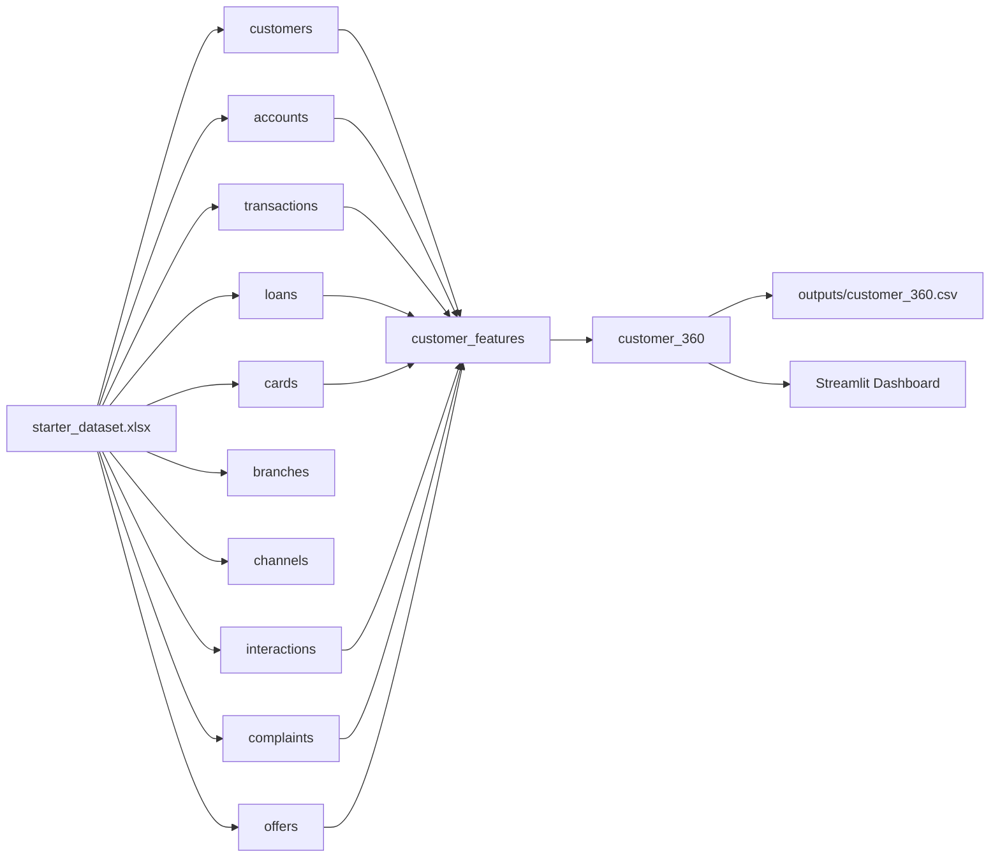

# Modeling Diagram

## Logical Model

The Customer 360 pipeline follows a layered analytical design:

- raw business entities are loaded from the Excel workbook
- customer-level features are aggregated in `customer_features`
- business-friendly segments and actions are derived in `customer_360`

## Mermaid Diagram

## Modeling Notes

### Raw Layer

The raw layer mirrors the business entities delivered in the starter workbook.

### Feature Layer

`customer_features` aggregates customer metrics across products, transactions, service, and offers.

### Consumption Layer

`customer_360` adds the business-facing semantic layer:

- customer value segment
- digital engagement flag
- activity status
- churn-risk segment
- next best action

## Join Logic

The model uses `customer_id` as the primary integration key.

All feature aggregates are grouped by `customer_id` and then left-joined back to `customers`, ensuring one final row per customer.
